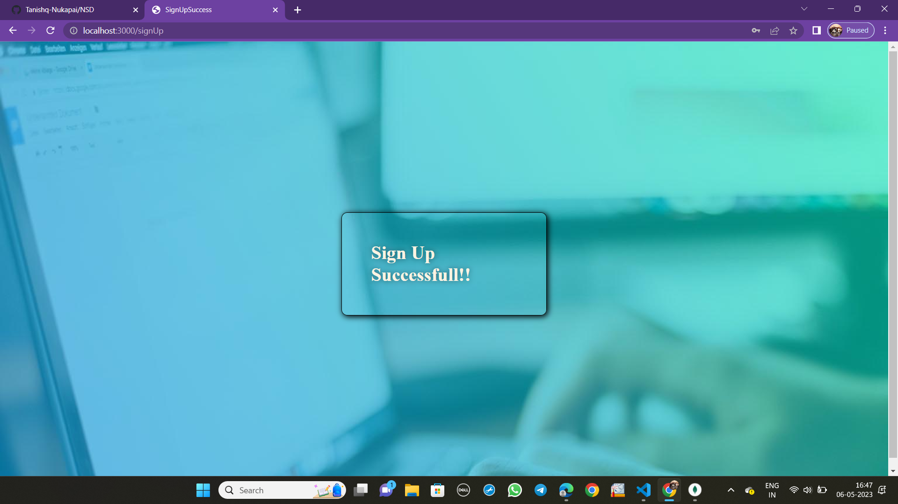

# Sign Up page
## NSD Assignment
### Along with the give files please install all the node modules and dependencies required:
`npm init -y`

### Before proceeding to run the sign-up form, the following dependencies must be succesfully installed on your system.
Check and install express by using the following command: 
`npm install express`

### Setup "mongoose", as it sits on top of Node's MongoDB driver.
`npm install mongoose`

## Sample Images
Here are some sample images of the project in action. These images demonstrate working of the application.

